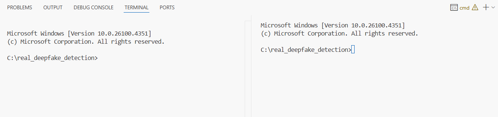
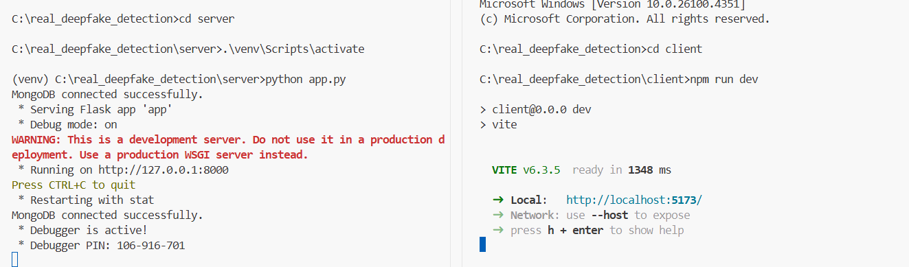
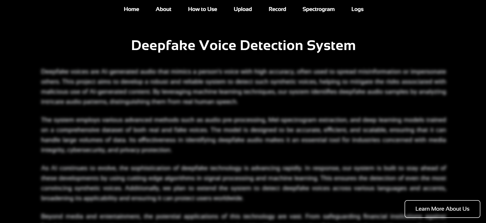

<h1 align="center">Deepfake Audio Detection</h1>

## About

Deepfake Audio Detection is a full-stack web application developed to classify voice recordings as either authentic or AI-generated. It addresses the growing need for reliable tools to combat the misuse of synthetic audio in areas like security, media, and communication. The project aims to provide an accessible, real-time solution that leverages cutting-edge machine learning techniques and a modern web-based interface.

The backend is powered by a fine-tuned `wav2vec2-large-xlsr-53` model, trained on a custom dataset composed of both publicly available samples and live-recorded audio from verified human speakers. To improve the model’s robustness and generalization across different accents, environments, and languages, the training process incorporates several audio augmentation techniques such as pitch shifting, time-stretching, and noise injection. These steps help ensure the model performs well even under less-than-ideal audio conditions.

The frontend is built using React and Vite, providing a fast and intuitive interface. Users can upload `.wav` files and receive near-instant classification results, along with a visual preview of the Mel-spectrogram and a confidence score for each prediction. The system follows a modular design pattern, with components divided into layers for UI, processing, machine learning, data handling, and external APIs, making it scalable and easy to maintain.

The application is currently in active development, with plans to extend its capabilities further to include real-time streaming detection, multilingual model support, and more advanced explanation tools using visual AI interpretability. It demonstrates the integration of state-of-the-art speech models with modern web technologies to deliver a practical and efficient deepfake audio detection tool.

## Table of Conents

1. [Features](#features)
2. [Project Structure](#project-structure)
3. [Installation Instructions](#installation-instructions)
4. [Usage Instructions](#usage-instructions)

## Features

### Audio Input

- Upload `.wav`, `.mp3`, or other supported formats.
- Live microphone recording supported for real-time testing.

### Audio Preprocessing

- Automatic noise reduction and silence trimming.
- Resampling and normalization for consistent input quality.
- Feature extraction using Mel-spectrograms or MFCCs.

### Deepfake Voice Detection

- Deep learning-based binary classifier using CNN, LSTM, or hybrid models.
- Trained on multilingual datasets including English, Hindi, and Telugu.
- High performance on unseen, noisy, or low-quality audio samples.

### Evaluation and Metrics

- Displays classification metrics:
  - Accuracy
  - Precision
  - Recall
  - F1-score
  - ROC-AUC
- Confusion matrix visualization for model performance analysis.

### Visualization Dashboard

- Mel-spectrogram preview of uploaded/recorded audio.
- Shows prediction probability and confidence levels.
- Real vs. Deepfake classification result displayed clearly.

### Web Interface

- Intuitive frontend built with Streamlit or React.
- Drag-and-drop audio upload and responsive result display.
- Suitable for both end-users and demo environments.

### Modular Architecture

- Clean separation of concerns across the following layers:
  - `UI`: Interface components
  - `Processing`: Audio transformation and cleaning
  - `ML`: Model loading, inference, and training
  - `Data`: Input/output and MongoDB interactions
  - `Plug`: External integration and APIs

### Database Integration

- MongoDB backend to store:
  - User submissions
  - Audio metadata
  - Detection results and history logs

### Robustness and Generalization

- Incorporates data augmentation:
  - Pitch shifting
  - Time stretching
  - Noise injection
- Improves model generalization across languages and audio conditions.

### API Integration

- RESTful API support for integration with third-party tools.
- Accepts:
  - Base64-encoded audio
  - File uploads via HTTP
- Returns JSON response with detection results and confidence score.

## Project Structure

```bash
Deepfake-Audio-Detection/
│
├── client/                     # Frontend application (built with React + Vite)
│   ├── public/                 # Define static resources
│   ├── src/                    # Source code for React frontend (components, pages,images)
│   ├── .gitignore              # Git ignore rules for frontend
│   ├── eslint.config.js        # ESLint configuration for code linting
│   ├── index.html              # Entry HTML file
│   ├── package-lock.json       # Dependency lock file (npm)
│   ├── package.json            # Node package configuration and dependencies
│   └── vite.config.js          # Vite configuration for frontend build
│
├── server/                     # Backend server (Flask Integrated Application)
│   ├── database/               # MongoDB Connection
│   ├── model/                  # ML model files
│   ├── routes/                 # API route handlers for backend
│   ├── app.py                  # Main server application entry
│   └── requirements.txt        # Python dependencies list
│
├── .gitignore                  # Git ignore rules for the project

```

This project is organised as a full-stack application with separate frontend and backend components.

### Frontend (`client/`)

The frontend is built using **React** with **Vite** and is located in the `client/` directory.

- **`src/`**: Contains all React source code, including components, pages, and styling assets.
- **`public/`**: Holds static resources such as favicons and manifest files, served directly without processing.
- **`index.html`**: Entry HTML file where the React app is injected during build.
- **`package.json`**: Defines project metadata, npm dependencies, and scripts for running or building the frontend.
- **`package-lock.json`**: Locks exact versions of installed npm dependencies.
- **`vite.config.js`**: Vite configuration, including build options, plugins, and dev server settings.
- **`.gitignore`**: Specifies files and folders to ignore in the frontend repository.
- **`eslint.config.js`**: ESLint configuration for linting and enforcing code style guidelines.

### Backend (`server/`)

The backend is implemented using **Flask** and is located in the `server/` directory.

- **`database/`**: Contains configuration and connection logic for MongoDB.
- **`model/`**: Holds machine learning model files, including trained weights and inference scripts (wav2vec2-large-xlsr-53).
- **`routes/`**: Defines API route handlers for uploading audio files, running detection processes, and returning results.
- **`app.py`**: Main entry point for the Flask application. Initializes the app, loads the ML model, and registers routes.
- **`requirements.txt`**: Lists Python dependencies required to run the backend server.

#### Root Level

- **`.gitignore`**: Specifies global ignore rules for the entire project, including frontend and backend.

## Installation Instructions

### 1. Prerequisites

Before you can run the project you have to install some softwares:

1. MongoDB
2. ffmpeg
3. Python
4. Node JS which was previously mentioned in [Set Up the Front end](#3-set-up-the-front-end)

#### MongoDB installation

1. Download the installer from mongodb.com/try/download/community.
2. Run the .msi installer and follow the setup wizard (choose “Complete”).
3. Start MongoDB as a Windows service (default option).
4. Verify installation:

```bash
mongod --version
```

#### ffmpeg installation

1. Download the latest static build from: https://ffmpeg.org/download.html
2. Extract the zip, add the bin folder to your System PATH.
3. Verify with:

```bash
ffmpeg -version
```

#### Python installation

For this project we recommend to use Python 3.10 as the model was trained using Python 3.10. To avoid conflicts please stick to Python 3.10.

1. Go to the official download page:
   https://www.python.org/downloads/release/python-3100/
2. Click on the appropriate Windows installer (64-bit most common).
3. Run the installer.
   > **Important**: Check the box that says “Add Python to PATH”.
4. Choose “Install Now” and complete the installation.
5. Open Command Prompt and verify:

```bash
python --version
pip --version
```

### 2. Clone the Repository

````bash
git clone https://github.com/prem-vasanth/Deepfake-audio-detection-web-based.git
cd Deepfake-audio-detection-web-based```
````

### 3. Set up the Back end

First navigate to the back end folder by typing the following command:

```bash
cd server
```

#### Create a python environment named venv

To create a Python virtual environment named venv, run the following command inside your project directory:

```bash
python -m venv venv
```

#### Activate it

```bash
.venv\Scripts\activate
```

#### Install the requirements

```bash
pip install -r requirements.txt
```

### 4. Set up the Front end

Before you set up front end you must download Node JS:

1. Visit the official site: https://nodejs.org/
2. Download the .msi file
3. Run the installer and follow the setup instructions.

Navigate to the front end folder by typing the folowing command:

````bash
cd client```

````

#### Install the packages

```bash
npm install
```

### 5. Downloading the model

To complete the installation and sucessfully set up the project for running go to the link mentioned below:
https://drive.google.com/drive/folders/1UhkfcPGkBfu3mMsVj_cQFQIRyog88Wgh <br>
Download the folder and place it in the model folder located in the server folder.

## Usage Instructions

### 1. Setting the terminal

1. Open the folder in VS Code
2. Open the terminal
3. Click on the '+' button on the terminal
4. Drag one of the terminal over the other to make sure you have two terminals open side by side like shown below:
   

### 2. Setting up the front end

In one of the terminals type the following commands:

```bash
cd client
npm run dev
```

### 3. Setting up the back end

In the other teminral type the following commands:

```bash
cd server
.\venv\Scripts\activate
python app.py

```

### 4. Opening the website

In the split terminal present on the client side click on the local host link present by default its labelled as:
**http://localhost:5173/**, may vary depending on your system. It will look as shown in the figure below:


### 5 Preview:

The website will look like shown in the figure below, browse through the various pages and follow the instructions in the page **How to Use** to start classifying audios.

